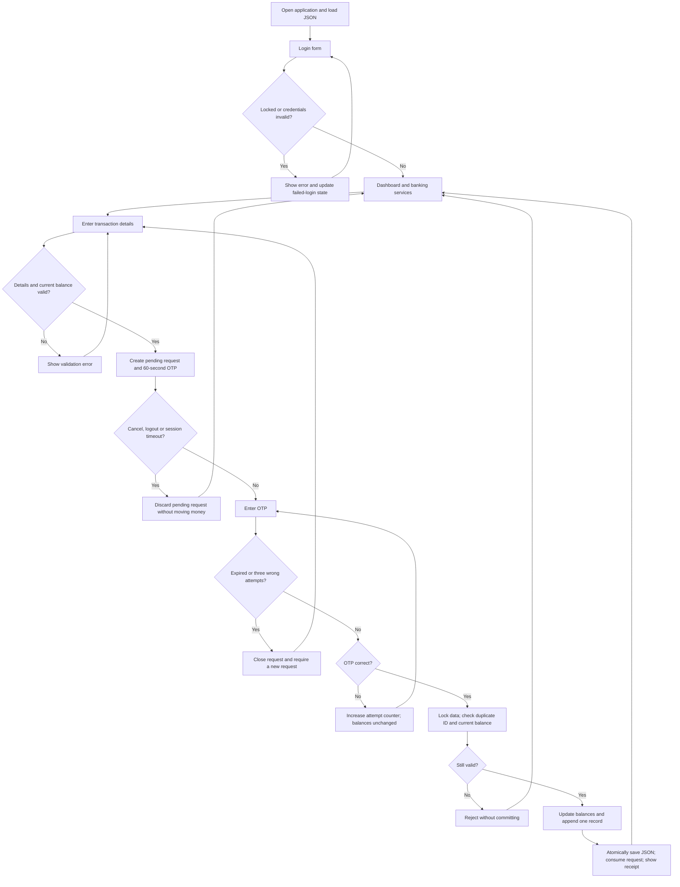

# Assignment requirements and remaining work

Requirements source: `BMCS2713_202605(Student).pdf`, pages 1-3 and 7-8. This file is a planning checklist, not report text.

- Course: BMCS2713 Introduction to Python Programming.
- Selected project: Project 1, Virtual Banking System.
- Deadline: Saturday, 19 September 2026. The PDF does not specify an exact submission time; check Google Classroom or your lecturer's announcement.
- Submit the report PDF, complete Python `.py` file and recorded demonstration to Google Classroom. Also provide the required AI Usage Disclosure Form and originality declaration.

## Required functionality

| PDF requirement | Prototype evidence | Student check |
|---|---|---|
| Username/password login | Authentication and UI login tests | Reproduce valid and invalid login |
| Dashboard with balance and banking options | Dashboard, metrics and sidebar | Capture your actual dashboard |
| Transfers between users, balance validation | Transfer tests, recipient history, browser transfer | Show both accounts' updated balances |
| Bill payments for different services | Electricity, Water, Internet, Mobile phone selectors | Demonstrate a bill payment |
| Credit card payments | Validated fictional card form and test | Demonstrate payment and masked history |
| Deposits that increase balance | OTP-protected deposit test | Demonstrate deposit and updated balance |
| Transaction history for all activities | Every successful banking activity has one stored record; transfer is visible to both users | Show history after using all services |
| OTP before completion | No balance change at preparation; incorrect, expired and duplicate OTP tests | Show an incorrect and a correct OTP |
| Tabs, buttons, sidebar and inputs | Streamlit interface and UI tests | Show all tabs during your recording |
| Invalid login, insufficient balance, incorrect OTP errors | Automated cases and real browser OTP error | Retain screenshots of these errors |

Authentication attempts are stored as lock counters rather than successful banking transaction records. Cancelled or rejected requests do not appear as completed transactions.

## Report checklist: write in your own words

| Prescribed section | Material to prepare yourself |
|---|---|
| Introduction | Purpose, importance of secure digital transactions, objectives, scope |
| Analysis | Problems addressed, functional requirements, software and hardware used |
| Design | Overall structure, system flowchart, actual UI screenshots |
| Programming | Technologies, each implemented module/function, selected important code with explanations |
| Testing | Functional/UI/input tests, actual results, bugs and how they were fixed |
| Enhancement | Future improvements, enhancement choices, bugs and resolutions |
| Conclusion | Actual outcomes and achievements |
| References | APA references for sources you actually cite |

- Recommended report length: 15-25 pages, not a stated mandatory range.
- Times New Roman: 12 pt titles, 11 pt body. Consolas may be used for code snippets.
- Cover page: your name, Student ID and Programme of Study.
- Use screenshots from your actual final version, after any changes you make.
- Do not invent test execution, bug discoveries, student reflections, sources or features.
- The PDF explicitly states that any AI-generated report text, partial or complete, is academic misconduct. It also requires independent work and disclosure of any permitted AI use. Consult your lecturer about permitted code assistance. This AI-assisted prototype must not be represented as unaided original student work.

## Rubric weights

| Criterion | Marks |
|---|---:|
| Core functionality and features | 10 |
| Creativity and optional enhancements | 10 |
| User interface and user experience | 10 |
| Code structure and organization | 10 |
| Testing and debugging | 10 |
| Documentation and report quality | 30 |
| Presentation and demonstration | 10 |
| Project complexity and technical effort | 10 |

## Recording checklist

Recommended duration: 1-4 minutes. Record the running app and explain its workflow yourself.

1. Start the Python application and show valid login and dashboard.
2. Show the insufficient-balance error.
3. Request a transfer OTP; show that the balance has not changed.
4. Show an incorrect OTP; then confirm correctly and show the receipt.
5. Demonstrate bill payment, credit card payment and deposit with OTP confirmation.
6. Show transaction history, CSV download, balance/spending charts and the recipient's balance.
7. Briefly demonstrate or explain the implemented enhancements, including expiry, account locking, session timeout, password hashes and persistence. Ensure all implemented features are covered.

Use only fictional details. Review the recording for readable text and an understandable explanation before submission. A captioned learning walkthrough from actual browser captures is included; your own recorded demonstration remains outstanding.

## System flowchart for checking your own design

## Completion status

- [x] PDF read and project selected.
- [x] AI-assisted prototype implemented.
- [x] Banking logic and Streamlit UI tests passed.
- [x] Real browser transfer and OTP error checked; screenshots captured.
- [x] All four services checked in a separate live browser dataset; exact ledger and CSV retained.
- [x] Captioned learning walkthrough prepared from live browser captures.
- [ ] Student review, permitted-use check and any original implementation changes.
- [ ] Student-authored report assembled and PDF visually verified.
- [ ] Recorded demonstration created and checked.
- [ ] Official AI Usage Disclosure Form and originality declaration completed by the student.
- [ ] Final submission files checked against the assignment.
